  

  
  
  
  
  

---

# ⚡ Awesome Energy Trading & Risk Management (ETRM / CTRM)

> **The definitive, curated ecosystem of enterprise SaaS platforms, open-source risk engines, power system analytics, and commodity trading technologies.**  
> *Focusing on deal capture, position management, physical scheduling, market & credit risk analytics (xVA, VaR), power grid dispatch, and regulatory compliance.*

---

## 💡 Executive Summary & Market Insights

**Energy Trading and Risk Management (ETRM)** and **Commodity Trading and Risk Management (CTRM)** systems serve as the digital backbone for power utilities, energy traders, oil majors, gas producers, and financial institutions worldwide. 

- **Market Size**: The global ETRM/CTRM software market is estimated at **$2.2 Billion – $3.5 Billion** (projected to expand to **~$4.8 Billion by 2030** at a CAGR of ~6.8%).
- **Market Structure**: The sector is **highly concentrated** (oligopolistic / winner-take-most). Enterprise holding companies—most notably **ION Group** (which consolidated Openlink Endur, Allegro, Aspect, RightAngle, and Triple Point), alongside **SAP SE** and **FIS**—dominate core trade lifecycles and physical logistics.
- **Open-Source Reality**: Open-source solutions in physical ETRM logistics (scheduling, settlements, inventory) remain extremely rare due to high regulatory complexity and domain specificity. However, open-source innovation is thriving in **risk analytics engines** (e.g., QuantLib, Open Source Risk Engine) and **power systems optimization** (e.g., PyPSA, pandapower).

---

## 📚 Table of Contents

- [🏢 Enterprise SaaS & Commercial CTRM Platforms](#-enterprise-saas--commercial-ctrm-platforms)
- [🔓 Open-Source GitHub Repositories & Libraries](#-open-source-github-repositories--libraries)
- [📊 Market & Technology Comparison Matrix](#-market--technology-comparison-matrix)
- [🤝 How to Contribute](#-how-to-contribute)
- [📈 Star History](#-star-history)
- [💖 Support & Sponsoring](#-support--sponsoring)
- [⚖️ Disclaimer](#%EF%B8%8F-disclaimer)

---

## 🏢 Enterprise SaaS & Commercial CTRM Platforms

> **Market Landscape Note**: The global ETRM market is estimated at **$2.2B – $3.5B** and is **highly concentrated**, dominated by market heavyweights ION Group, SAP SE, and FIS. Below is the curated table of leading commercial SaaS and enterprise platforms, sorted descending by company enterprise size / valuation.

| Product | Company Size & Valuation | Description | Pricing (Starting Tiers) | Free Tier & Trial Limits |
| :--- | :--- | :--- | :--- | :--- |
| **[SAP S/4HANA Commodity Management](https://www.sap.com/)** | **Market Cap: ~$260B** *(Annual Rev: ~$35B)* | Enterprise ERP extension providing integrated commodity management, financial risk controls, and accounting for global industrial conglomerates. | Starts at **$500,000 / year** (S/4HANA module extension) | No free forever plan; **14-day guided sandbox trial** environment with pre-configured sample trade data. |
| **[Hitachi Energy Velocity](https://www.hitachienergy.com/)** | **Market Cap: ~$95B** *(Annual Rev: ~$80B)* | Grid enablement & market intelligence platform integrating generation planning with power trading risk analytics and regional congestion reporting. | Starts at **$250,000 / year** (Enterprise base tier) | No free forever plan; **30-day web sandbox demo** available upon enterprise evaluation request. |
| **[FIS Aligne](https://www.fisglobal.com/)** | **Market Cap: ~$45B** *(Annual Rev: ~$10B)* | Established ETRM platform for North American and European power and gas markets, handling trade capture, risk, and settlements. | Starts at **$350,000 / year** (Mid-tier utility package) | No free forever plan; **14-day proof-of-concept (PoC) instance** provided during qualified sales discovery. |
| **[ION Openlink Endur](https://www.iongroup.com/)** | **Valuation: ~$20B** *(Annual Rev: ~$2.5B)* | Flagship multi-commodity ETRM system for supermajors and energy giants. Unmatched depth in crude oil, refined products, natural gas, and power. | Starts at **$600,000 / year** (Core Tier A deployment; up to $3M+) | No free forever plan; **30-day staged RFP evaluation environment** for enterprise buyers. |
| **[ION Allegro Horizon](https://www.allegrodev.com/)** | **Valuation: ~$20B** *(Annual Rev: ~$2.5B)* | Mid-to-large tier ETRM with exceptional strength in North American gas, power, and logistics scheduling. | Starts at **$300,000 / year** (Regional trading desk package) | No free forever plan; **14-day guided trial test instance** with sample market data feeds. |
| **[ION RightAngle](https://www.iongroup.com/)** | **Valuation: ~$20B** *(Annual Rev: ~$2.5B)* | Specialized midstream and refined products CTRM for pipeline scheduling, refining margins, and product distribution. | Starts at **$400,000 / year** (North American midstream setup) | No free forever plan; **30-day enterprise evaluation environment** for qualified petroleum clients. |
| **[ION Aspect CTRM](https://www.iongroup.com/)** | **Valuation: ~$20B** *(Annual Rev: ~$2.5B)* | Cloud-native multi-commodity CTRM offering faster deployment (4-9 months) for mid-market trading houses and trade desks. | Starts at **$150,000 / year** (Base Cloud SaaS license up to 10 desks) | No free forever plan; **14-day free cloud trial** with sample trade books and read/write test environment. |
| **[Triple Point Commodity XL](https://www.iongroup.com/)** | **Valuation: ~$20B** *(Annual Rev: ~$2.5B)* | Part of ION Group. Covers oil, gas, metals, and ags trade capture, position management, risk analytics, and physical shipping. | Starts at **$250,000 / year** (Multi-commodity trade suite) | No free forever plan; **14-day corporate sandbox demo** with synthetic market data feeds. |
| **[Eka (Quor) Energy](https://www.eka.com/)** | **Valuation: ~$300M** *(Annual Rev: ~$60M)* | Cloud-based CTRM platform featuring modular apps for position tracking, MTM, risk management, and physical trade logistics. | Starts at **$200,000 / year** (Mid-market cloud module package) | No free forever plan; **30-day free trial** on select Eka Cloud analytics modules for registered desks. |
| **[Brady Technologies](https://www.bradytechnologies.com/)** | **Valuation: ~$100M** *(Annual Rev: ~$30M)* | European ETRM specialist with strong market position in European power, gas, and base metals trading. | Starts at **$180,000 / year** (European power/gas module) | No free forever plan; **14-day guided proof-of-concept test drive** with EEX/ICE power data. |
| **[Molecule (Elektra)](https://molecule.io/)** | **Valuation: ~$50M** *(Annual Rev: ~$12M)* | Modern, cloud-native ETRM focused on power and renewables. Features hourly PPA modeling, battery storage reporting, and automated ISO data feeds. | Starts at **$60,000 / year** ($5,000 / month base tier) | No free forever plan; **14-day full-access trial** with automated ISO downloads & API endpoints. |
| **[Enuit Entrade](https://www.enuit.com/)** | **Valuation: ~$40M** *(Annual Rev: ~$15M)* | Flexible CTRM platform supporting global physical and financial energy trades, mark-to-market, and risk calculations. | Starts at **$120,000 / year** (Base physical trade & risk tier) | No free forever plan; **30-day sandbox evaluation** for verified commodity trading entities. |
| **[Amphora](https://www.amphora.com/)** | **Valuation: ~$30M** *(Annual Rev: ~$12M)* | Focused global oil and liquid products trading solution providing deal capture, accounting, and risk management. | Starts at **$100,000 / year** (Oil trade management suite) | No free forever plan; **14-day guided enterprise test environment** for liquid product trade lifecycles. |
| **[OpenCTRM](https://www.openctrm.com/)** | **Valuation: ~$10M** *(Annual Rev: ~$3M)* | Lightweight, product-led SaaS CTRM offering transparent subscription plans, open APIs, and rapid onboarding. | Starts at **$11,988 / year** ($999 / month up to 50 open trades) | **30-day full-feature free trial** with access to MTM reporting and REST APIs (up to 25 test trades). |

---

## 🔓 Open-Source GitHub Repositories & Libraries

> **Community Open-Source Note**: Open-source tools excel in quantitative risk modeling, derivative pricing, and power system optimization. Below are the premier open-source repositories in energy quantitative finance and grid analysis, sorted descending by GitHub star counts.

- **[QuantLib](https://github.com/lballabio/QuantLib)**  
    
  *The gold standard open-source library for quantitative finance.* Provides extensive instrument modeling, yield curve bootstrapping, Monte Carlo frameworks, and option pricing engines (~2,400 source files, 360k+ lines of C++ with Python bindings).

- **[PyPSA (Python for Power System Analysis)](https://github.com/PyPSA/PyPSA)**  
    
  *Premier open-source framework for power system optimization.* Simulates unit commitment, optimal power flow (OPF), sector coupling (electricity, gas, heat), and long-term multi-period investment planning for renewable grid transitions.

- **[pandapower](https://github.com/e2nIEE/pandapower)**  
    
  *Convenient power system modeling and analysis tool.* Merges the data analysis capabilities of `pandas` with the power flow solver capabilities of `PYPOWER` for grid distribution networks.

- **[Open Source Risk Engine (ORE)](https://github.com/OpenSourceRisk/Engine)**  
    
  *Enterprise risk analytics framework built on QuantLib.* Sponsored by LSEG Post Trade (Acadia). Delivers Monte Carlo simulation, Credit Exposure (PFE, EPE), xVA valuation adjustments (CVA, DVA, FVA, MVA), and historical VaR. Used by 150+ institutional financial participants.

- **[PowerModels.jl](https://github.com/LANL-ANSI/PowerModels.jl)**  
    
  *Julia package for power network optimization.* Formulates steady-state power flow equations across AC, DC, and relaxation models for high-performance grid compute.

- **[Grid2Op](https://github.com/rte-france/grid2op)**  
    
  *Modular modular testbed for AI and Reinforcement Learning in grid operations.* Developed by RTE France to simulate power network dispatch, topology control, and automated market balancing.

- **[oemof-solph](https://github.com/oemof/oemof-solph)**  
    
  *Model generator for energy system optimization.* Enables linear and mixed-integer modeling of multi-commodity energy systems combining power, natural gas, heat, and hydrogen storage.

- **[Calliope](https://github.com/Calliope-project/calliope)**  
    
  *Multi-scale energy system modeling framework.* Designed for analyzing renewable generation spatial distributions, capacity expansion planning, and operational economic dispatch.

- **[finmath-lib](https://github.com/finmath/finmath-lib)**  
    
  *Mathematical finance library in Java.* Implements interest rate derivative pricing, stochastic processes, and Monte Carlo algorithms for quantitative risk measurement.

- **[Eclipse Tradista](https://github.com/eclipse-tradista/tradista)**  
    
  *Modular open-source financial platform hosted by the Eclipse Foundation.* Unifies cross-asset trade capture, risk management, and post-trade operations under an Apache-2.0 open-source model.

- **[etrm](https://github.com/johan-lillrank/etrm)**  
    
  *R package for energy trading and financial risk management.* Provides tools for forward market curve construction, seasonal price modeling, and portfolio risk insurance strategies.

---

## 🤝 How to Contribute

We welcome community contributions to keep this ecosystem comprehensive, accurate, and up-to-date!

1. **Fork the Repository**: Click the `Fork` button at the top right of this page.
2. **Add / Modify Entries**: Update [README.md](README.md) maintaining tabular formatting and star badge conventions.
3. **Submit a Pull Request**: Include a clear description of your addition (verify links, factual pricing, or star badges).

For major framework additions or structural feedback, check our main portal at [Awesome-Awesome-Awesome](https://github.com/ishandutta2007/Awesome-Awesome-Awesome).

---

## 📈 Star History

---

## 💖 Support & Sponsoring

Thank you for exploring **Awesome Energy Trading & Risk Management**! If this repository has assisted your quantitative research, trading infrastructure evaluation, or technology stack selection, please consider supporting the project:

- ⭐ **Star** this repository to show your support and improve discoverability.
- 🔀 **Fork** it to contribute missing SaaS platforms, open-source projects, or research papers.
- 📢 **Share** it with fellow traders, quantitative analysts, risk managers, and energy technology engineers.
- ☕ **Buy Me a Coffee**: Sponsor the project directly via the [GitHub Sponsor Dashboard](https://github.com/sponsors/ishandutta2007).

  

---

## ⚖️ Disclaimer

- This list is **community-curated** for educational, analytical, and research purposes.
- ETRM systems handle regulated financial, physical commodity, and critical energy infrastructure data. Always ensure compliance with relevant financial authorities (e.g., FERC, CFTC, REMIT, EMIR) and enterprise security standards.
- Commercial system pricing, trial parameters, and valuations reflect industry estimations and public benchmark disclosures as of late 2026.
